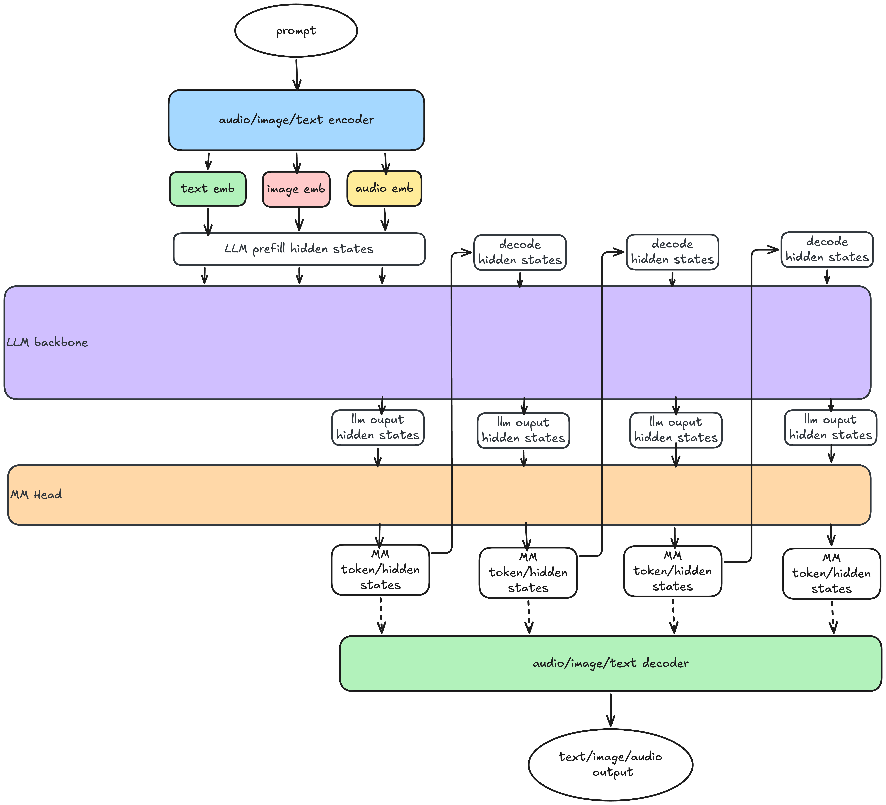
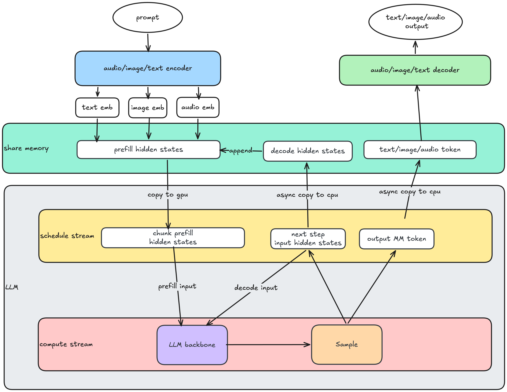
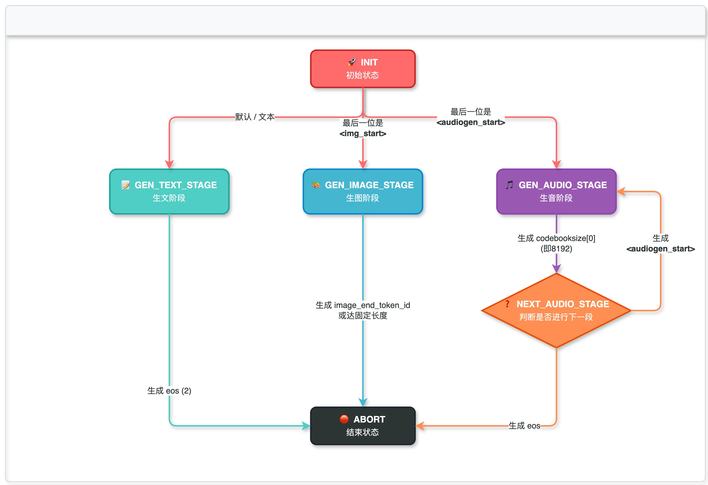

# NMM Infer

A multimodal inference testing framework supporting Image Understanding, Image Generation, Audio-to-Text, Speech Synthesis, and Audio-to-Audio tasks.

> 🚀 **Looking for an advanced multimodal inference framework?**
> Check out **[Omni-Flow](https://github.com/meituan-longcat/omni-flow)** — a unified workflow orchestration and distributed KV cache sharing framework that natively supports LongCat-Next and other multimodal models (DeepSeek-V2, HunyuanImage-3, and more). It provides flexible pipeline composition, cross-role KV cache sharing, and seamless SGLang integration for high-throughput deployments.

## Architecture & Design

Native Multimodal Models (NMMs) introduce unique challenges to traditional LLM inference frameworks. We design this system to balance model flexibility with inference efficiency, enabling rapid iteration while leveraging proven LLM inference optimization techniques.

### Inference Pipeline

Our inference workflow consists of three core stages, each handling distinct responsibilities in the multimodal processing chain:



**Data Flow Details:**

1. **Input Processing:** Diverse modal inputs (images, audio, text) are encoded into a unified Hidden State representation by modality-specific encoders
2. **Core Inference:** The LLM Core processes these Hidden States and produces contextualized representations that serve both as output and input for the next iteration
3. **Multimodal Output Generation:** 
   - A task-aware head generates multi-modal tokens from the LLM output
   - These tokens are simultaneously converted back into Hidden States for potential next-step inference
   - Finally, tokens are routed to modality-specific decoders (audio vocoder, image refiner, etc.) to produce the final outputs

### Architectural Optimization

To minimize latency and memory overhead while supporting efficient multi-step inference, we have implemented the following system-level optimizations:



**Key Optimizations:**

- **Unified Hidden State Interface:** All modality-specific inputs are converted to a uniform Hidden State representation before entering the LLM. This abstraction enables a single forward path regardless of input type, simplifying optimization and enabling cross-modal reasoning.
- **Decoupled Generation Interface:** A dedicated Sample interface separates token generation from model.forward(). This allows efficient multi-step generation where outputs and next-step inputs can be prepared asynchronously without blocking computation.
- **Shared Memory I/O Pipeline:** Embeddings and results are passed through shared memory channels with overlap scheduling, enabling input preparation and output processing to occur concurrently with model execution—dramatically reducing iteration latency.
- **Smart Prefix Caching:** We extend traditional KV-cache with Hidden State caching. Since LLM inputs are already in Hidden State form, we cache these high-level representations directly, eliminating redundant encoding while maintaining perfect semantic cache hits.

### Inference State Machine

Multimodal generation often requires precise sequencing—for example, generating an image before processing follow-up text, or synthesizing speech after generating transcripts. We implement a lightweight state machine that interprets special tokens from the LLM output to dynamically route processing through different modality decoders, enabling complex multi-step workflows without external orchestration.



## Requirements

- CUDA >= 12.9

## Installation

```bash
git clone https://github.com/meituan-longcat/LongCat-Next-inference.git
cd LongCat-Next-inference
git checkout main
sh setup.sh
```

## Quick Start

```bash
# Setup environment
source create_env.sh
source set_env.sh

# Run tests
python3 demo.py \
    --model-path ${MODEL_PATH} \
    --sequential \
    --output-dir output \
    --tasks img_gen img_und aud_2_txt spk_syn aud_2_aud
```

## Arguments

| Argument | Short | Description | Default |
|----------|-------|-------------|---------|
| `--model-path` | `-m` | Model path (required) | - |
| `--output-dir` | `-o` | Output directory | `output` |
| `--sequential` | `-s` | Execute tests sequentially | Concurrent |
| `--tasks` | `-t` | Specify task types | All tasks |

## Task Types

| Argument | Task Name | Description |
|----------|-----------|-------------|
| `img_gen` | Image Generation | Image generation |
| `img_und` | Image Understanding | Visual understanding |
| `aud_2_txt` | Audio-to-Text | Audio question answering / Audio understanding |
| `spk_syn` | Speech Synthesis | Speech synthesis |
| `aud_2_aud` | Audio-to-Audio | Audio question answering |

## Examples

```bash
# Run only image generation
python3 demo.py -m ${MODEL_PATH} -t img_gen

# Run vision tasks sequentially
python3 demo.py -m ${MODEL_PATH} -s -t img_gen img_und

# Run all tasks
python3 demo.py -m ${MODEL_PATH}
```

## Test Case Configuration

Test cases are configured in `example/test_cases.yaml`. Modify the parameters as needed.
